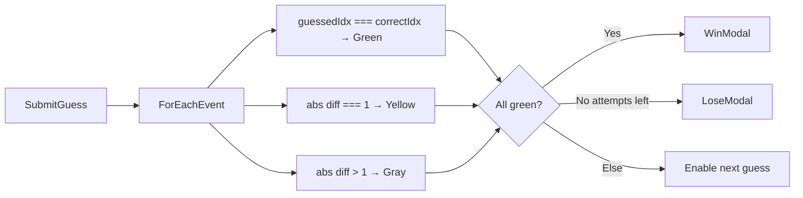
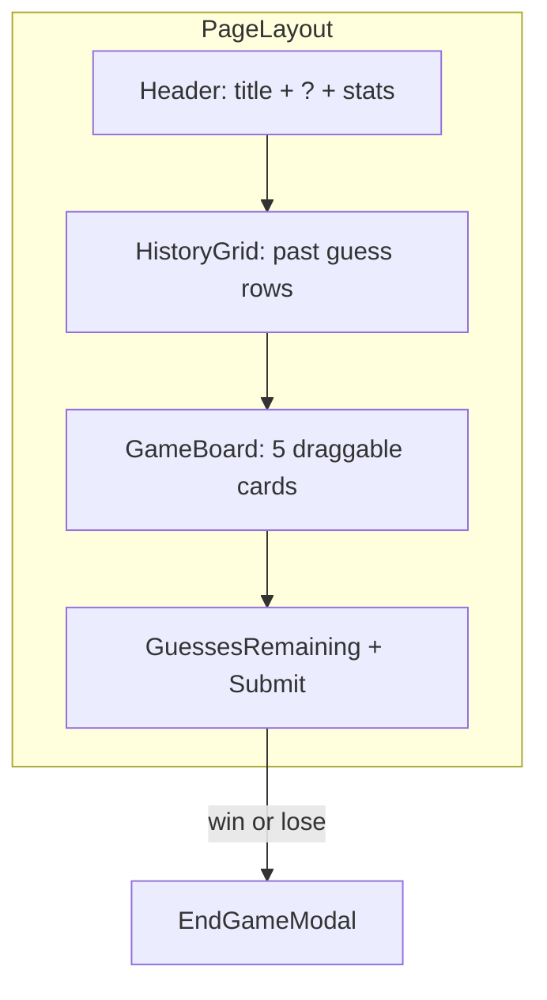
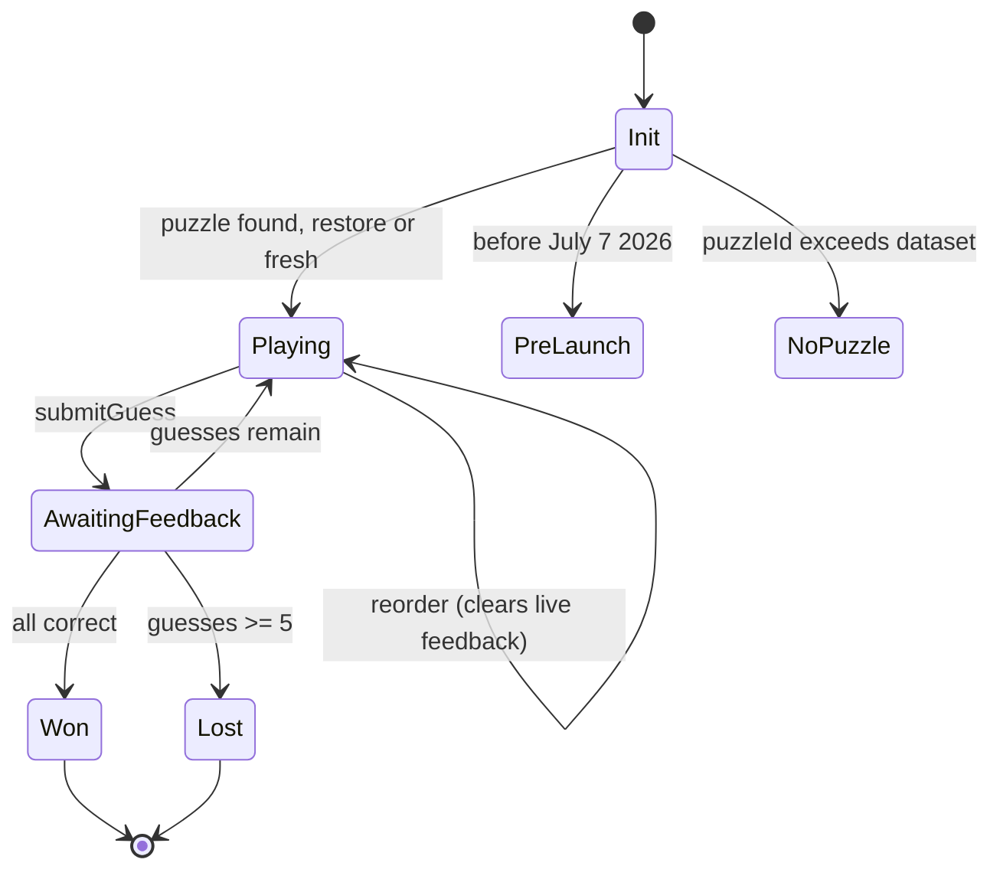

# Chrono-Sort: Sports Edition — Design Review & Implementation Plan

## Design Review (Expert Assessment)

Your GDD is solid and closely mirrors proven daily-puzzle patterns (Wordle, Connections). The core loop — reorder → submit → positional feedback → repeat — is clear and satisfying. A few gaps are worth resolving up front; the plan below bakes in sensible defaults.

### Strengths
- **Position-based feedback** (`guessedIndex === correctIndex` / off-by-1 / off-by-2+) is intuitive and maps cleanly to green/yellow/gray.
- **5 attempts for 5 items** gives a fair skill curve (perfect order is hard; near-misses are learnable).
- **History grid** above the board gives at-a-glance progress without re-reading card text.
- **End-game timeline with dates** turns every session into a learning moment — essential for a history game.

### Gaps Clarified (defaults for v1)

| Topic | GDD silence | Planned default |
|---|---|---|
| Post-submit behavior | Can player reorder between attempts? | Yes — cards stay in last-submitted order; player drags to adjust for next guess |
| In-progress save | "daily progress" mentioned | Save current order, guesses used, and history to `localStorage`; restore on same-day revisit |
| Streak rules | Not specified | Current streak increments on win; resets on loss or missed day (no play recorded yesterday) |
| Shuffle consistency | "not sorted chronologically" | Deterministic shuffle seeded by `puzzleId` so all players see the same starting order |
| Puzzle exhaustion | Finite JSON list | If `puzzleId > puzzles.length`, show "Come back tomorrow" / cycle message (start with ~30 puzzles) |
| Mobile drag handle | Desktop-only grab icon | Hide handle on `< md`; full card is draggable on touch |
| Share URL | `chrono-sort-sports.com` | Use as placeholder constant; easy to swap at deploy time |

### Feedback Logic (confirmed)



Emoji mapping for share/history: Green = `🟩`, Yellow = `🟨`, Gray = `⬛`.

---

## Tech Stack

- **Scaffold:** [Vite](https://vitejs.dev/) + React 18 + TypeScript
- **Styling:** Tailwind CSS v4 (or v3 per Vite template defaults), mobile-first
- **Drag-and-drop:** `@dnd-kit/core` + `@dnd-kit/sortable` + `@dnd-kit/utilities` (react-beautiful-dnd is unmaintained)
- **State:** React hooks only — no Redux
- **Storage:** `localStorage` via a small `useLocalStorage` / `gameStorage` module
- **Daily puzzle:** `puzzleNumber = daysBetween('2026-07-07', todayLocal) + 1`

---

## Project Structure

```
Chrono-Sports/
├── index.html
├── package.json
├── vite.config.ts
├── tailwind.config.js
├── tsconfig.json
├── public/
└── src/
    ├── main.tsx
    ├── App.tsx
    ├── index.css                 # Tailwind directives + sporty font import
    ├── types/
    │   └── game.ts               # Event, Puzzle, GuessResult, GameStatus, Stats
    ├── data/
    │   └── puzzles.json          # Array of { id, events[] } — 30+ puzzles
    ├── utils/
    │   ├── puzzle.ts             # getTodayPuzzle(), getPuzzleNumber(), shuffleEvents()
    │   ├── evaluate.ts           # evaluateGuess(order, correctOrder) → FeedbackColor[]
    │   ├── share.ts              # buildShareText(puzzleNum, history, won)
    │   └── storage.ts            # load/save game state + lifetime stats
    ├── hooks/
    │   └── useGame.ts            # Core game state machine
    └── components/
        ├── Header.tsx
        ├── GameBoard.tsx         # DndContext + SortableContext wrapper
        ├── EventCard.tsx         # Sortable card with feedback colors
        ├── HistoryGrid.tsx       # Wordle-style rows of 5 squares
        ├── Controls.tsx          # Guesses remaining + Submit button
        ├── Modal.tsx             # Shared modal shell
        ├── HowToPlayModal.tsx
        ├── StatsModal.tsx
        └── EndGameModal.tsx      # Timeline, stats, share button
```

---

## Implementation Todos

| ID | Task | Status |
|---|---|---|
| scaffold | Scaffold Vite + React + TS + Tailwind; install @dnd-kit packages; add constants + index.css theme | pending |
| types-data | Create types/game.ts, puzzles.json (30 puzzles), and pure utils (puzzle, evaluate, share, storage, date) | pending |
| unit-tests | Add Vitest; test evaluate, puzzle number, shuffle seed, streak logic, share text | pending |
| use-game-hook | Implement useGame hook: state machine, daily init, submit, reorder, win/lose, localStorage sync | pending |
| game-ui | Build GameBoard, EventCard (dnd-kit), HistoryGrid, Controls, Header, Toast | pending |
| modals | Build Modal shell + HowToPlay, Stats, EndGame (timeline, share clipboard) | pending |
| edge-screens | Build NoPuzzleScreen (pre-launch / post-dataset) and CompletedDayBanner | pending |
| polish-qa | Polish responsive UI, a11y, streak/midnight edge cases, manual QA matrix | pending |
| deploy | Add GitHub Actions or Vercel config; verify production build + HTTPS clipboard | pending |

---

## Core Data Types

`src/types/game.ts`:

```ts
type FeedbackColor = 'correct' | 'close' | 'wrong';
type GameStatus = 'playing' | 'won' | 'lost';

interface SportEvent {
  id: string;
  text: string;
  date: string; // ISO "YYYY-MM-DD"
}

interface Puzzle {
  id: number;
  events: SportEvent[];
}

interface GuessRecord {
  order: string[];           // event ids top→bottom
  feedback: FeedbackColor[];
}

interface DayState {
  puzzleId: number;
  currentOrder: string[];
  guesses: GuessRecord[];
  status: GameStatus;
  dateKey: string;           // "YYYY-MM-DD" local
}

interface LifetimeStats {
  gamesPlayed: number;
  gamesWon: number;
  currentStreak: number;
  maxStreak: number;
  lastPlayedDate: string | null;
}
```

---

## Key Implementation Details

### 1. Daily Puzzle Selection — `src/utils/puzzle.ts`

- `LAUNCH_DATE = new Date(2026, 6, 7)` (July 7, 2026 — local timezone)
- `getPuzzleNumber()`: floor day-diff from launch to today (local midnight-to-midnight)
- Lookup `puzzles.find(p => p.id === puzzleNumber)`; if missing, render a friendly "no puzzle today" screen
- `getCorrectOrder(puzzle)`: sort event ids by `date` ascending (oldest = slot 1 / index 0)
- `getShuffledOrder(puzzle, seed)`: Fisher-Yates with seeded PRNG from `puzzleId` so order is stable per day

### 2. Guess Evaluation — `src/utils/evaluate.ts`

For each event in the player's current order (index = `guessedIndex`):

```ts
const correctIndex = correctOrder.indexOf(eventId);
if (guessedIndex === correctIndex) return 'correct';
if (Math.abs(guessedIndex - correctIndex) === 1) return 'close';
return 'wrong';
```

After submit:
- Append `{ order, feedback }` to `guesses`
- If all `'correct'` → `status = 'won'`, open EndGameModal
- Else if `guesses.length >= 5` → `status = 'lost'`, open EndGameModal
- Else keep `status = 'playing'`; cards retain feedback colors until next drag (clear feedback on reorder)

### 3. Drag-and-Drop — `src/components/GameBoard.tsx`

- `DndContext` with `closestCenter` collision + `PointerSensor` (8px activation distance for mobile scroll tolerance)
- `SortableContext` with `verticalListSortingStrategy`
- Each `EventCard` uses `useSortable`; apply `transform` + `transition` for snap animation
- Disable dragging when `status !== 'playing'`
- Desktop: `⠿` handle via `listeners` on handle only; mobile: listeners on full card

### 4. History Grid — `src/components/HistoryGrid.tsx`

- Render `guesses.map(g => row of 5 squares)` above the active board
- Map colors: `correct → bg-green-500`, `close → bg-yellow-500`, `wrong → bg-gray-500`
- Squares are non-interactive, ~16–20px, with small gap

### 5. localStorage — `src/utils/storage.ts`

Keys:
- `chrono-sort-day-{YYYY-MM-DD}` → `DayState` (in-progress or completed today)
- `chrono-sort-stats` → `LifetimeStats`

On win/loss:
- Increment `gamesPlayed`; increment `gamesWon` on win
- Streak: if `lastPlayedDate === yesterday` and won → `currentStreak++`; if gap > 1 day → reset to 1 (win) or 0 (loss); update `maxStreak`
- Set `lastPlayedDate = today`

On mount: if saved `DayState.dateKey === today` and `puzzleId` matches, restore; else start fresh.

### 6. Share Text — `src/utils/share.ts`

```
Chrono-Sort: Sports #1
⏱️ 3/5
🟨🟩⬛⬛🟨
🟩🟩🟨🟨⬛
🟩🟩🟩🟩🟩
https://chrono-sort-sports.com
```

- `⏱️ X/5` = attempts used (or `5/5` on loss)
- One emoji row per guess in order
- `navigator.clipboard.writeText()` + brief "Copied!" toast

### 7. UI / Visual Design

- **Font:** `Bebas Neue` or `Oswald` (Google Fonts) for "CHRONO-SORT" title; system sans for body
- **Cards:** `rounded-lg shadow-md border border-gray-200`, min-height for touch targets (48px+)
- **Submit button:** full-width, `bg-blue-600 hover:bg-blue-700`, disabled when game over or mid-evaluation
- **Modals:** centered overlay, `max-w-md`, focus trap, close on backdrop click / Escape
- **Responsive:** single column, max-width ~480px centered (Wordle-like column)



---

## Initial Puzzle Dataset

Start with **30 puzzles** in `src/data/puzzles.json` (id 1–30), each with 5 real, verifiable sports events across eras. Puzzle #1 uses your sample events (shuffled at runtime). Expand the JSON over time — no code changes needed beyond adding entries.

---

## Implementation Phases

### Phase 1 — Scaffold
- `npm create vite@latest . -- --template react-ts`
- Add Tailwind, `@dnd-kit/*`, configure paths and base styles
- Wire `App.tsx` shell with centered layout

### Phase 2 — Core Logic (no UI polish)
- Types, `puzzles.json`, `evaluate.ts`, `puzzle.ts`, `storage.ts`
- `useGame` hook: init, submit, reorder, win/lose transitions
- Unit-testable pure functions for evaluate + puzzle number

### Phase 3 — Game UI
- `GameBoard`, `EventCard`, `HistoryGrid`, `Controls`
- Wire dnd-kit reorder → `useGame`
- Feedback colors on cards after submit

### Phase 4 — Modals & Meta
- `Modal` shell, HowToPlay, Stats, EndGame (timeline + share)
- Header icon triggers
- Clipboard share with fallback for older browsers

### Phase 5 — Polish & QA
- Persist/restore day state; streak edge cases (midnight rollover, missed days)
- Keyboard/a11y: sortable keyboard coords via dnd-kit
- Manual test matrix: win on guess 1/5/5, lose on guess 5, revisit same day, new day reset

---

## Risks & Mitigations

- **Timezone edge cases:** Always use `new Date()` local date parts, not UTC, for `dateKey` and puzzle number
- **Clipboard on HTTP localhost:** Works on `localhost`; production needs HTTPS
- **Puzzle # runs past dataset:** Guard with friendly message; plan to add puzzles before day 31
- **Touch scroll vs drag:** 8px `activationConstraint` on PointerSensor prevents accidental drags while scrolling

---

## Out of Scope (v1)

- Backend / user accounts / global leaderboards
- Analytics
- i18n
- Animated card flips (nice-to-have later)

---

## Expanded Architecture

### App Orchestration — `src/App.tsx`

`App` is the top-level coordinator. It does not hold game logic — only modal visibility and layout.

```tsx
function App() {
  const game = useGame();
  const [activeModal, setActiveModal] = useState<'howto' | 'stats' | 'end' | null>(null);
  const [toast, setToast] = useState<string | null>(null);

  // Auto-open end modal when status transitions to won/lost
  useEffect(() => {
    if (game.status === 'won' || game.status === 'lost') setActiveModal('end');
  }, [game.status]);

  if (game.screen === 'pre-launch') return <PreLaunchScreen launchDate={LAUNCH_DATE} />;
  if (game.screen === 'no-puzzle') return <NoPuzzleScreen puzzleNumber={game.puzzleNumber} />;

  return (
    <div className="min-h-dvh bg-neutral-100 flex flex-col items-center px-4 py-6">
      <Header onHowTo={() => setActiveModal('howto')} onStats={() => setActiveModal('stats')} />
      <main className="w-full max-w-[480px] flex flex-col gap-4">
        <HistoryGrid guesses={game.guesses} />
        <GameBoard ... />
        <Controls ... />
      </main>
      {/* modals + Toast */}
    </div>
  );
}
```

**Screen states** (derived in `useGame`, not stored):

| `screen` | Condition |
|---|---|
| `pre-launch` | `today < LAUNCH_DATE` |
| `no-puzzle` | `puzzleNumber > puzzles.length` |
| `playing` | default — active board |

---

### Constants — `src/constants.ts`

```ts
export const LAUNCH_DATE = { year: 2026, month: 6, day: 7 }; // July 7 local
export const MAX_GUESSES = 5;
export const EVENT_COUNT = 5;
export const SHARE_URL = 'https://chrono-sort-sports.com';
export const STORAGE_PREFIX = 'chrono-sort';
export const FEEDBACK_CLASSES = {
  correct: 'bg-green-500 text-white',
  close: 'bg-yellow-400 text-black',
  wrong: 'bg-gray-500 text-white',
} as const;
export const FEEDBACK_EMOJI = { correct: '🟩', close: '🟨', wrong: '⬛' } as const;
```

---

### Date Utilities — `src/utils/date.ts`

All date math uses **local calendar days**, never UTC `toISOString().slice(0,10)` (avoids off-by-one near midnight in AU/US timezones).

```ts
function toDateKey(d: Date): string;           // "2026-07-07"
function parseDateKey(key: string): Date;
function daysBetween(a: Date, b: Date): number; // b - a in whole local days
function getTodayDateKey(): string;
function getYesterdayDateKey(): string;
function isBeforeLaunch(today: Date): boolean;
```

`getPuzzleNumber()`:

```ts
export function getPuzzleNumber(today = new Date()): number {
  const launch = new Date(LAUNCH_DATE.year, LAUNCH_DATE.month, LAUNCH_DATE.day);
  if (today < launch) return 0; // pre-launch sentinel
  return daysBetween(launch, today) + 1;
}
```

---

### Seeded Shuffle — `src/utils/puzzle.ts`

```ts
// Mulberry32 — small, deterministic PRNG
function seededRandom(seed: number): () => number;

export function shuffleEventIds(ids: string[], seed: number): string[] {
  const arr = [...ids];
  const rand = seededRandom(seed);
  for (let i = arr.length - 1; i > 0; i--) {
    const j = Math.floor(rand() * (i + 1));
    [arr[i], arr[j]] = [arr[j], arr[i]];
  }
  return arr;
}

export function getCorrectOrder(events: SportEvent[]): string[] {
  return [...events].sort((a, b) => a.date.localeCompare(b.date)).map(e => e.id);
}

export function getEventMap(events: SportEvent[]): Record<string, SportEvent> {
  return Object.fromEntries(events.map(e => [e.id, e]));
}
```

---

### `useGame` State Machine — `src/hooks/useGame.ts`



**Hook return shape:**

```ts
interface UseGameReturn {
  screen: 'pre-launch' | 'no-puzzle' | 'playing';
  puzzle: Puzzle | null;
  puzzleNumber: number;
  eventsById: Record<string, SportEvent>;
  currentOrder: string[];
  guesses: GuessRecord[];
  liveFeedback: FeedbackColor[] | null;
  guessesRemaining: number;
  status: GameStatus;
  stats: LifetimeStats;
  correctOrder: string[];
  reorder: (newOrder: string[]) => void;
  submitGuess: () => void;
  canSubmit: boolean;
}
```

**Initialization sequence** (runs once on mount + on date change):

1. `puzzleNumber = getPuzzleNumber()`
2. If `puzzleNumber === 0` → `screen = 'pre-launch'`
3. If no puzzle in JSON → `screen = 'no-puzzle'`
4. `saved = loadDayState(todayDateKey)`
5. If `saved?.puzzleId === puzzleNumber` → restore `currentOrder`, `guesses`, `status`
6. Else → `currentOrder = shuffleEventIds(ids, puzzleNumber)`, empty guesses, `status = 'playing'`

**`submitGuess` rules:**

- No-op if `status !== 'playing'` or `guesses.length >= MAX_GUESSES`
- Compute `feedback = evaluateGuess(currentOrder, correctOrder)`
- Push to `guesses`; set `liveFeedback = feedback`; persist
- If all correct → `status = 'won'` → `recordGameResult(true)`
- Else if `guesses.length >= MAX_GUESSES` → `status = 'lost'` → `recordGameResult(false)`

**`reorder` rules:**

- No-op if `status !== 'playing'`
- Update `currentOrder`; set `liveFeedback = null`; persist

**`canSubmit`:** `status === 'playing' && guessesRemaining > 0 && liveFeedback === null`

> After submit, block duplicate consecutive orders to prevent accidental double-submit.

---

### Streak Algorithm — `src/utils/storage.ts`

```ts
function recordGameResult(won: boolean, today = getTodayDateKey()): LifetimeStats {
  const stats = loadStats();
  const played = stats.lastPlayedDate === today;

  if (!played) {
    stats.gamesPlayed += 1;
    if (won) stats.gamesWon += 1;
  }

  if (won) {
    if (stats.lastPlayedDate === getYesterdayDateKey()) {
      stats.currentStreak += 1;
    } else if (stats.lastPlayedDate !== today) {
      stats.currentStreak = 1;
    }
  } else {
    stats.currentStreak = 0;
  }

  stats.maxStreak = Math.max(stats.maxStreak, stats.currentStreak);
  stats.lastPlayedDate = today;
  saveStats(stats);
  return stats;
}
```

**Win % display:** `Math.round((gamesWon / gamesPlayed) * 100)` or `0` if no games.

---

### Component APIs

#### `Header.tsx`

```ts
interface HeaderProps {
  onHowTo: () => void;
  onStats: () => void;
}
```

#### `EventCard.tsx`

```ts
interface EventCardProps {
  event: SportEvent;
  feedback: FeedbackColor | null;
  disabled: boolean;
  dragHandleOnly: boolean;
}
```

#### `HistoryGrid.tsx`

```ts
interface HistoryGridProps {
  guesses: GuessRecord[];
}
```

#### `Controls.tsx`

```ts
interface ControlsProps {
  guessesRemaining: number;
  onSubmit: () => void;
  canSubmit: boolean;
  status: GameStatus;
}
```

#### `Modal.tsx`

```ts
interface ModalProps {
  title: string;
  isOpen: boolean;
  onClose: () => void;
  children: React.ReactNode;
}
```

#### `EndGameModal.tsx`

```ts
interface EndGameModalProps {
  won: boolean;
  puzzleNumber: number;
  events: SportEvent[];
  guesses: GuessRecord[];
  stats: LifetimeStats;
  onShare: () => Promise<void>;
  onClose: () => void;
}
```

---

### Puzzle Content Guidelines

Each puzzle in `src/data/puzzles.json` should follow:

- **5 events** with verified ISO dates
- **Spread across decades**
- **Mix sports** — NBA, soccer, Olympics, tennis, boxing, etc.
- **Recognizable names**
- **No duplicate events** across the 30-puzzle dataset

**Puzzle #1:**

| Event | Date |
|---|---|
| Muhammad Ali's Rumble in the Jungle | 1974-10-30 |
| Miracle on Ice | 1980-02-22 |
| Tiger Woods wins first Masters | 1997-04-13 |
| Kobe Bryant scores 81 points | 2006-01-22 |
| Leicester City wins Premier League | 2016-05-02 |

---

### Testing — Vitest

| File | Cases |
|---|---|
| `evaluate.test.ts` | all correct; all wrong; mixed; edge off-by-1 at boundaries |
| `puzzle.test.ts` | puzzle #1 on launch day; puzzle #2 next day; pre-launch returns 0; shuffle stable per seed |
| `date.test.ts` | `toDateKey` local; `daysBetween` across month boundary |
| `share.test.ts` | emoji rows match feedback; header format; attempts count |
| `storage.test.ts` | streak continues on consecutive wins; resets on loss; no double-count same day |

---

### Manual QA Matrix

| # | Scenario | Expected |
|---|---|---|
| 1 | Fresh load July 7 2026 | Puzzle #1, shuffled order, 5 guesses |
| 2 | Submit perfect first guess | Win modal, 1 green row in history |
| 3 | Submit 5 wrong guesses | Lose modal, 5 history rows |
| 4 | Refresh mid-game | State restored from localStorage |
| 5 | Complete game, refresh | Completed state restored; board locked |
| 6 | Open stats after win | Games +1, win% updated, streak +1 |
| 7 | Share button | Clipboard matches emoji spec |
| 8 | Drag on mobile | Card moves without page scroll hijack |
| 9 | Date before launch | Pre-launch screen |
| 10 | Puzzle #31 with 30 puzzles | No-puzzle screen |

---

### Deployment

**Recommended:** Vercel or Netlify (free tier, HTTPS for clipboard).

1. `npm run build` → `dist/`
2. Connect GitHub repo `Josh-eng2/Chrono-Sports`
3. Set build command `npm run build`, output `dist`
4. Custom domain: `chrono-sort-sports.com` → DNS CNAME to host

---

### Implementation Order (file-by-file)

1. `constants.ts`, `types/game.ts`, `utils/date.ts`
2. `utils/evaluate.ts` + tests
3. `utils/puzzle.ts` + tests
4. `data/puzzles.json` (puzzles 1–5 first for dev, then 6–30)
5. `utils/storage.ts`, `utils/share.ts` + tests
6. `hooks/useGame.ts`
7. `Modal.tsx` → `HowToPlayModal`, `StatsModal`
8. `EventCard.tsx` → `GameBoard.tsx` → `HistoryGrid.tsx` → `Controls.tsx` → `Header.tsx`
9. `EndGameModal.tsx`, `Toast.tsx`
10. `App.tsx` wire-up
11. Edge screens: `PreLaunchScreen`, `NoPuzzleScreen`
12. Polish pass + full QA matrix
